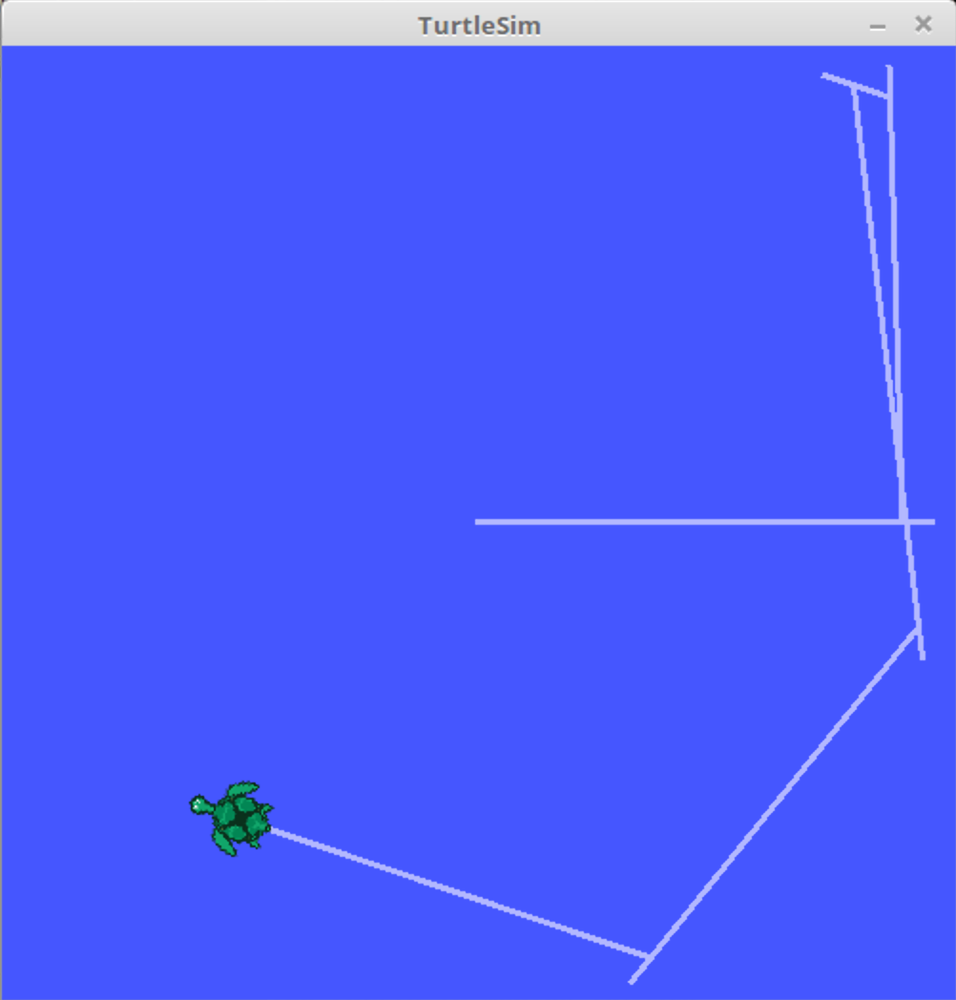
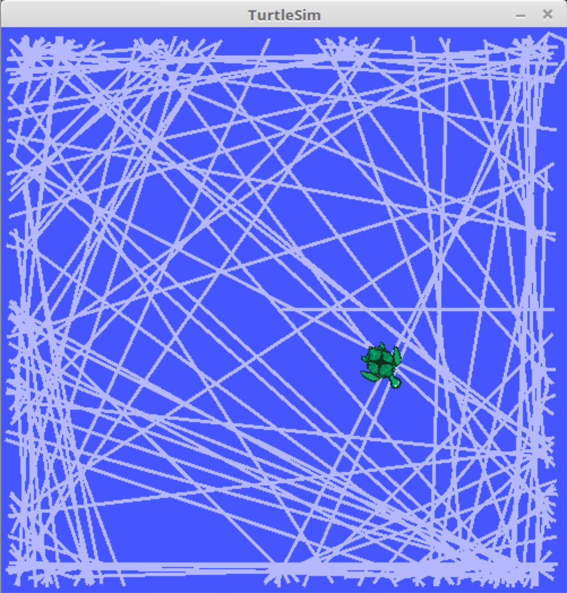
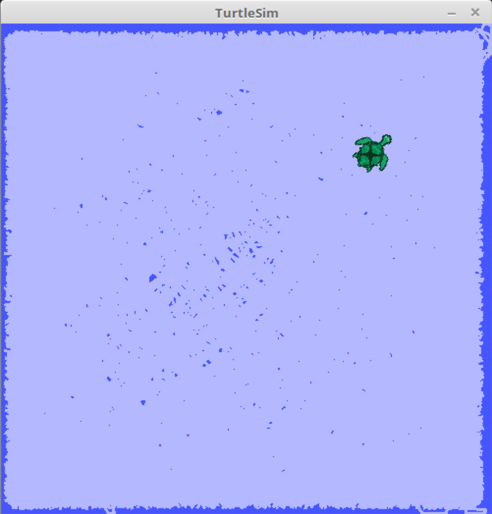

# Workspace Limits Avoidance

Avoiding workspace boundaries!
A ROS package for robots that avoids workspace boundaries during navigation.

<p align="center">
	<a href="#prerequisite">Prerequisite</a>
	<span> • </span>
	<a href="#compile">Compile</a>
	<span> • </span>
	<a href="#execute">Execute</a>
	<span> • </span>
	<a href="#use">Use</a>
	<span> • </span>
	<a href="#screenshots">Screenshots</a>
</p>

## <a id="prerequisite"></a>Prerequisite

* [ROS](http://wiki.ros.org/ROS/Installation) - An open-source, meta-operating system for your robots. The repository has been tested using ROS Kinetic.

## <a id="compile"></a>How to Compile

1. Move this package folder (`workspace-limits-avoidance`) to the `src` directory of your ROS workspace, for example `~/catkin_ws/src/`.
2. Open a terminal window and navigate to your ROS workspace directory, e.g.:

	```bash
	cd ~/catkin_ws/
	```
3. Build the package using the `catkin_make` command:

	```bash
	catkin_make
	```
This will compile the package and generate the necessary files for running the ROS nodes.


## <a id="execute"></a>How to Execute
1. Open a terminal window.
2. Navigate to your ROS workspace directory.
3. Launch the package using the following command:

	```bash
	roslaunch workspace_limits_avoidance workspace_limits_avoidance.launch
	```
This will launch the ROS nodes required to run the package.


## <a id="use"></a>How to Use

1. The turtle moves randomly within the workspace, avoiding walls and boundaries.
2. When the turtle gets too close to a wall or boundary, it stops.
3. The turtle then moves back a little and rotates randomly.
4. After that, the turtle moves forward again and repeats the cycle.
5. The turtle continues to move indefinitely, and the terminal prints various information. You can exit the program at any time by pressing `ESC`.


## <a id="screenshots"></a>Screenshots

* 6th pseudo-random move:
<p align="center" width="100%">
     
</p>

* then, after a couple of minutes...:
<p align="center" width="100%">
     
</p>

* ... and after a couple of hours:
<p align="center" width="100%">
     
</p>
